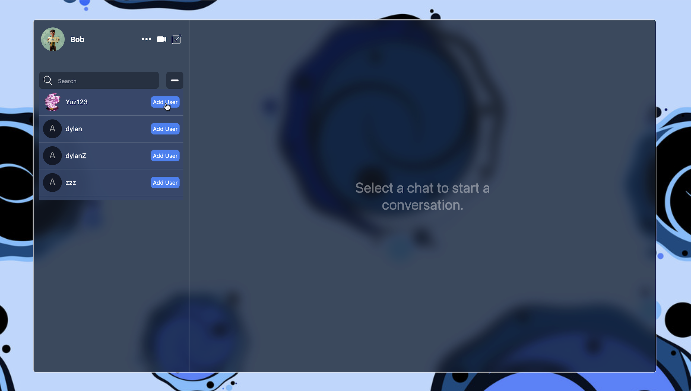

<h1 align="center">Real-Time Chat App 💬</h1>


## Highlights:

- ⚙️ Tech stack: React, Express.js, Tailwind CSS
- 🔐 JWT Authentication with Secure Cookie Storage
- 🧵 Real-time Communication via WebSockets
- 🖼️ Image Uploading with Cloudinary
- 🍃 MongoDB Backend with Custom Middleware
- 🪝 State Management with Zustand
- 📦 Efficient Data Fetching with React Query

## Features

- **Secure Authentication**: Sign up and log in using a secure JWT-based auth system (stored in HTTP-only cookies)  
  

- **Responsive UI**: Enjoy a clean, responsive interface designed with Tailwind CSS for all screen sizes  
  

- **Friend Requests**: Add, accept, or decline friend requests with a smooth user experience  
  
  
  

- **Real-Time Messaging**: Chat seamlessly with friends using WebSockets for instant message delivery  
  
  
  

- **Image Sharing**: Upload and send images directly in chat using Cloudinary integration  
  
  

- **Efficient State & Data Management**: Zustand handles client state, while React Query manages server state for performance and scalability

## Technologies Used

- **React**: Frontend UI framework
- **Express.js**: Backend server and API routing
- **Tailwind CSS**: Utility-first styling for responsive design
- **WebSockets**: Real-time bi-directional communication
- **MongoDB**: NoSQL database for storing user and chat data
- **JWT (JSON Web Tokens)**: Authentication with secure cookie storage
- **Zustand**: Lightweight state management for frontend
- **React Query**: Server state synchronization and caching
- **Cloudinary**: Image hosting and transformation
- **Axios**: Promise-based HTTP client

---

## 📦 Installation

```bash
# Clone the repository
git clone https://github.com/your-username/chat-app.git

# Install dependencies
cd chat-app
npm install

# Start the server
npm run dev